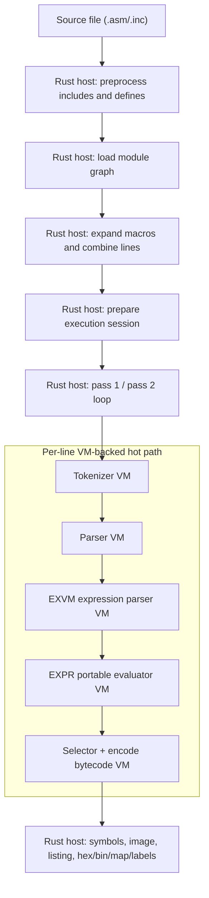

<!-- SPDX-License-Identifier: GPL-3.0-or-later -->

# opForge Assembler VM Path Guide (v0.1 Draft)

Status: first draft working guide  
Last updated: 2026-05-11

See also:
- [VM Boundary & Protocol Specification (v1)](vm-boundary-protocol-v1.md)
- [libopforge Execution Modes and Lockstep Guide](libopforge-execution-modes-and-lockstep-guide.md)
- [libopforge Developer Guide](libopforge-developer-guide.md)

## 1. Purpose

This guide explains the current VM-oriented assembly path in opForge from the point where a source file is handed to the assembler to the point where bytes and output artifacts are emitted.

It is written as a human-oriented walkthrough rather than a normative specification. The goal is to make it easy to answer questions like:

- Where does the Rust host stop and the VM path begin?
- Which steps still belong to ordinary Rust orchestration?
- How do tokenization, parsing, expression work, and instruction encoding fit together?
- Which VM instruction sets exist, and what does each one do?

## 2. Short Version

The current opForge assembler is not "a VM that does everything."

Instead, it is a Rust host that coordinates several narrower VM-backed stages:

1. Rust loads and preprocesses source files.
2. Rust builds the module graph and expands macros.
3. Rust runs pass 1 and pass 2 over the expanded lines.
4. For each line, the hot path goes through VM-backed tokenization, parser-envelope execution, VM-backed expression work, and VM-backed instruction selection/encoding when the active family requires it.
5. Rust still owns the pass loop, symbol/image/listing state, and final artifact emission.

That split is visible in the current implementation:

- CLI entry builds the request in [`crates/opforge-cli-core/src/run.rs#L131-L191`](../crates/opforge-cli-core/src/run.rs#L131-L191).
- Session preparation expands and loads sources in [`crates/opforge-engine/src/lib.rs#L1049-L1100`](../crates/opforge-engine/src/lib.rs#L1049-L1100).
- Final execution runs pass 1, pass 2, and outputs in [`crates/opforge-engine/src/lib.rs#L1360-L1660`](../crates/opforge-engine/src/lib.rs#L1360-L1660).
- The VM-backed line router lives in [`crates/opforge-engine/src/lib.rs#L140-L192`](../crates/opforge-engine/src/lib.rs#L140-L192).

### 2.1 Current `opcore` VM coverage

If you are specifically asking whether "`opcore` is VM-backed now," the most accurate answer is: partly, not fully.

| Area | Current state | Notes |
|---|---|---|
| Expression requests | VM-backed path exists | Engine expression routing supports `ExecutionMode::Vm` and `Lockstep` for `opcore` expression requests: [`crates/opforge-engine/src/processing.rs#L62-L123`](../crates/opforge-engine/src/processing.rs#L62-L123) |
| Expression parse/eval in assembler flow | VM-backed authoritative path exists | On the authoritative `EXVM v2` path, `.opcore` runtime helpers emit `PortableExprProgram` directly for covered forms and hand that tape to `EXPR v2`; the Rust `Expr` backend remains compatibility/debug output rather than the canonical seam. |
| Module-item routing surface | VM-backed path exists | `route_module_item_line_with_model(...)` and `process_module_item_request_with_model(...)` can recognize module-item forms through the VM-backed line parser: [`crates/opforge-engine/src/processing.rs#L150-L174`](../crates/opforge-engine/src/processing.rs#L150-L174), [`crates/opforge-vm/src/vm_opcore.rs#L115-L152`](../crates/opforge-vm/src/vm_opcore.rs#L115-L152) |
| Preprocessor | Not VM-backed | Still ordinary host preprocessing: [`crates/opforge-engine/src/lib.rs#L274-L318`](../crates/opforge-engine/src/lib.rs#L274-L318) |
| Macro expansion | Not VM-backed | Still handled by `AsmMacroProcessor` during graph expansion: [`crates/opforge-engine/src/source_graph.rs#L577-L623`](../crates/opforge-engine/src/source_graph.rs#L577-L623) |
| Module-graph bootstrap scan | Not VM-backed in current implementation | The source-graph scan still calls host `Parser::process_opcore_line_request(...)`: [`crates/opforge-engine/src/source_graph.rs#L246-L263`](../crates/opforge-engine/src/source_graph.rs#L246-L263) |

So the current system should be read as:

- not "all `opcore` is VM-backed,"
- not "no `opcore` is VM-backed,"
- but "selected `opcore` concerns already have VM-backed paths, while bootstrap and preprocessing concerns remain host-side."

## 3. End-to-End Pipeline

## 4. Stage-by-Stage Walkthrough

### 4.1 CLI or host request setup

The common CLI path starts in `run_one`, which converts CLI configuration into an `Assembler::builder(...)` call and then invokes `assemble()`. See [`crates/opforge-cli-core/src/run.rs#L131-L191`](../crates/opforge-cli-core/src/run.rs#L131-L191).

At this point the work is still purely host-side. No VM has run yet.

### 4.2 Source expansion and preprocessing

The first real transformation is source expansion:

- `expand_source_file_with_dependencies_with_provider(...)` builds a `Preprocessor`, installs include roots and defines, and expands the root file: [`crates/opforge-engine/src/lib.rs#L274-L318`](../crates/opforge-engine/src/lib.rs#L274-L318)
- `prepare_assembly_session(...)` calls that expansion step before anything else: [`crates/opforge-engine/src/lib.rs#L1049-L1062`](../crates/opforge-engine/src/lib.rs#L1049-L1062)

This stage is host-owned by design. The VM path does not currently replace the preprocessor.

### 4.3 Module graph loading and module-item scanning

After preprocessing the host resolves modules and `.use` dependencies with `load_module_graph_with_provider(...)`: [`crates/opforge-engine/src/source_graph.rs#L519-L667`](../crates/opforge-engine/src/source_graph.rs#L519-L667)

The important split is:

- Rust owns graph traversal, recursion, ambiguity reporting, dependency tracking, and ordering.
- The scan logic relies on parser-processed line ASTs to find `.module` and `.use` forms.
- In the current implementation, that scan is still host-side `opcore` parsing via `Parser::process_opcore_line_request(...)`, not the pass-time VM hot path: [`crates/opforge-engine/src/source_graph.rs#L246-L263`](../crates/opforge-engine/src/source_graph.rs#L246-L263)

Useful anchors:

- active module-item scan: [`crates/opforge-engine/src/source_graph.rs#L246-L311`](../crates/opforge-engine/src/source_graph.rs#L246-L311)
- recursive module load: [`crates/opforge-engine/src/source_graph.rs#L402-L485`](../crates/opforge-engine/src/source_graph.rs#L402-L485)
- dependency expansion and macro injection: [`crates/opforge-engine/src/source_graph.rs#L574-L657`](../crates/opforge-engine/src/source_graph.rs#L574-L657)

In other words, Rust decides which files belong in the build, but it uses parser-level understanding of lines to recognize module/import forms.

### 4.4 Macro expansion and combined source creation

Still inside `load_module_graph_with_provider(...)`, Rust runs `AsmMacroProcessor` over dependency modules first and then the root module, injects visible exports, and produces one combined list of expanded lines plus a `SourceMap`: [`crates/opforge-engine/src/source_graph.rs#L577-L667`](../crates/opforge-engine/src/source_graph.rs#L577-L667)

This is still host-owned work. The current VM path is not the macro engine.

### 4.5 Session preparation and runtime-model setup

`prepare_assembly_session(...)` resolves the CPU/session config and returns prepared lines, source map, dependency files, and module macro metadata: [`crates/opforge-engine/src/lib.rs#L1049-L1100`](../crates/opforge-engine/src/lib.rs#L1049-L1100)

When the actual assembly run begins, `run_assembly_with_prepared(...)`:

- creates the assembler,
- installs the runtime line router,
- sets runtime package/model state,
- runs pass 1,
- plans outputs,
- runs pass 2,
- emits artifacts.

See [`crates/opforge-engine/src/lib.rs#L1360-L1660`](../crates/opforge-engine/src/lib.rs#L1360-L1660).

### 4.6 Pass 1 and pass 2 are host-owned

The `asm::engine::Assembler` type owns pass orchestration:

- pass 1: [`crates/opforge-asm/src/engine.rs#L164-L369`](../crates/opforge-asm/src/engine.rs#L164-L369)
- pass 2: [`crates/opforge-asm/src/engine.rs#L371-L443`](../crates/opforge-asm/src/engine.rs#L371-L443)

Those passes:

- keep symbol and section state,
- maintain image/layout state,
- collect runtime processing traces,
- aggregate lockstep/parity data,
- detect structural errors like unterminated conditionals or modules.

The host owns the loop. The VM helps decide what an individual line means and how a VM-authoritative instruction encodes, but the VM is not running the whole assembler session.

### 4.7 The line hot path

The main per-line handoff happens inside `AsmLine::process_with_runtime_tokenizer(...)`: [`crates/opforge-asm/src/line.rs#L1078-L1155`](../crates/opforge-asm/src/line.rs#L1078-L1155)

That function:

1. loads the active execution model,
2. sends the line through the runtime router,
3. stores line-end metadata,
4. records processing traces and lockstep results,
5. hands the resulting AST to `process_ast(...)`.

If a custom router is installed, the engine uses `EngineRuntimeLineRouter::parse_line(...)`: [`crates/opforge-engine/src/lib.rs#L140-L187`](../crates/opforge-engine/src/lib.rs#L140-L187)

That router:

- tokenizes with the VM model,
- routes the line through the editor/processor split,
- returns an AST, spans, trace information, and optional lockstep results.

### 4.8 Tokenization

The direct VM tokenization bridge is `tokenize_parser_tokens_with_model(...)`: [`crates/opforge-vm/src/vm_opasm_parse.rs#L68-L90`](../crates/opforge-vm/src/vm_opasm_parse.rs#L68-L90)

That function does three things:

1. asks the execution model for portable tokens,
2. maps portable tokens back into core token structures,
3. computes end-of-line parser metadata.

The actual runtime entrypoint is `HierarchyExecutionModel::tokenize_portable_statement_for_assembler(...)`: [`crates/opforge-vm/src/execution_model/tokenizer_bridge.rs#L45-L94`](../crates/opforge-vm/src/execution_model/tokenizer_bridge.rs#L45-L94)

The tokenizer VM executor itself lives in `RuntimeModelCore::tokenize_with_vm_core(...)`: [`crates/opforge-vm/src/runtime_model_core.rs#L593-L900`](../crates/opforge-vm/src/runtime_model_core.rs#L593-L900)

What matters operationally:

- Rust resolves the active hierarchy and token policy.
- The tokenizer VM runs with strict budget checks.
- An empty result for a non-empty line is treated as an error.

### 4.9 Parser-envelope execution

Once tokens exist, `parse_line_with_model_with_expr_handler(...)` validates the parser contract, resolves the parser VM program, enforces budget limits, and runs the parser VM: [`crates/opforge-vm/src/vm_opasm_parse.rs#L112-L169`](../crates/opforge-vm/src/vm_opasm_parse.rs#L112-L169)

The parser VM executor is `parse_line_with_parser_vm(...)`: [`crates/opforge-vm/src/execution_model/parser_vm.rs#L17-L205`](../crates/opforge-vm/src/execution_model/parser_vm.rs#L17-L205)

Its job is small but important:

- it does not parse a whole grammar from scratch,
- it executes a parser-envelope program,
- each opcode tries one envelope shape such as dot-directive, star-org, assignment, or instruction,
- the first successful envelope produces the line AST.

The default family parser program is generated in [`crates/opforge-vm/src/builder.rs#L850-L868`](../crates/opforge-vm/src/builder.rs#L850-L868).

### 4.10 Expression parsing and evaluation

Expression work sits in the `.opcore` VM surface, but it is split into two
separate VM contracts:

- `EXVM` is the expression parser VM. On the authoritative v2 path it consumes
    a token slice and emits `PortableExprProgram` directly for the covered
    grammar, while retaining a Rust `Expr` output backend for compatibility,
    debugging, and explicit fallback-only shapes.
- `EXPR` is the portable expression evaluator VM. It evaluates that
    `PortableExprProgram` rather than depending on a mandatory post-parse Rust
    AST-lowering seam.

Key entrypoints:

- parse an assembler expression token range into a portable program: [`crates/opforge-vm/src/vm_opcore.rs#L1478`](../crates/opforge-vm/src/vm_opcore.rs#L1478)
- evaluate a portable expression program under the active family contract: [`crates/opforge-vm/src/vm_opcore.rs#L1595`](../crates/opforge-vm/src/vm_opcore.rs#L1595)
- compile scalar or shape-preserving `EXPR` programs: [`crates/opforge-core/src/expr_vm.rs#L493`](../crates/opforge-core/src/expr_vm.rs#L493), [`crates/opforge-core/src/expr_vm.rs#L511`](../crates/opforge-core/src/expr_vm.rs#L511)
- evaluate scalar or shape-preserving `EXPR` programs: [`crates/opforge-core/src/expr_vm.rs#L529`](../crates/opforge-core/src/expr_vm.rs#L529), [`crates/opforge-core/src/expr_vm.rs#L541`](../crates/opforge-core/src/expr_vm.rs#L541)

`PRVM` owns statement and operand-shape parsing. When a parser VM program uses
`ParseOperandExprRange`, the subcall boundary is the pure expression token range
inside that operand. That range is routed to authoritative `EXVM` coverage; CPU
family operand wrappers remain outside `EXVM`. Examples of operand shapes that
stay in PRVM/opasm handling include immediate operands, m68k tuple,
postincrement and predecrement forms, register pairs, bitfield suffixes, and
long-indirect bracket forms.

The actual portable expression evaluator VM is implemented in `opcore::expr_vm`:

- opcode definitions: [`crates/opforge-core/src/expr_vm.rs#L11-L128`](../crates/opforge-core/src/expr_vm.rs#L11-L128)
- execution loop: [`crates/opforge-core/src/expr_vm.rs#L321-L442`](../crates/opforge-core/src/expr_vm.rs#L321-L442)

Covered scalar leaf, unary, arithmetic, shift, comparison, bitwise/logical,
ternary, string-literal, and transparent scalar-wrapper expressions are now
lowered directly into `EXPR v2` bytecode and executed by the v2 scalar runtime.
The default family `EXPR` contract now resolves to `EXPR v2` for that scalar
coverage.

String-literal reduction still crosses the host boundary through
`eval_string_literal(...)`, but the bytecode carrier and scalar evaluation
ownership are now on the `EXPR v2` path. Immediate, indirect, and long-indirect
wrapper nodes are treated as transparent scalar wrappers on that path.

Structural value nodes are now part of the landed `EXPR v2` path as well.
Lists, ranges, struct types, struct literals, member access, and index access
can execute as typed values under `EXPR v2`, and shape-preserving evaluation is
available when a caller needs the structural result directly.

Scalar-only assembler callers still do not receive implicit structural
reductions. The v2 scalar path emits an explicit `RequireScalar` boundary, so an
irreducible list, range, struct type, or struct instance fails with a
deterministic diagnostic instead of silently falling back to host reduction.

`PRVM` and opasm still own operand-shape parsing outside the pure expression
token range, and one narrow host carveout remains: repetition-side-table
member/index forms such as `repeatLabel[index].field` stay on the host because
their semantics depend on assembler-owned iteration-scope side tables rather
than the generic `EXPR v2` value model.

This is an important design point: the line parser may still hand expression
slices to the expression layer, but parsing and evaluation are separate VM
contracts. `EXVM` owns covered mathematical expression syntax and now emits the
canonical portable tape directly on the authoritative path, while `EXPR`
executes that `PortableExprProgram` rather than re-walking the original text or
requiring a mandatory Rust AST-lowering seam.

On the authoritative `EXVM v2` parser path, covered expression grammar is
handled by real v2 bytecode rather than by the host-side
`RuntimeExpressionParser`. The host parser remains available only for explicit
legacy compatibility parsing and direct parser tests; it is not authoritative
for the covered `EXVM v2` grammar surface.

On the authoritative `EXVM v2` plus `EXPR v2` path, covered assembler
program-returning callers now follow `tokens -> EXVM bytecode ->
PortableExprProgram -> EXPR v2` as their primary seam. The older Rust `Expr`
backend and legacy core-expression compiler seam remain explicit compatibility
and debugging paths rather than the default carrier for covered authoritative
forms. For certified families, pass-2 unknown-symbol, budget, and
scalar-boundary failures stay on the VM error surface instead of silently
retrying host AST evaluation.

That authoritative eval default now includes the `motorola68000` family in
addition to the earlier `mos6502` and `intel8080` families. Within that family
scope, covered `m68000`, `m68010`, `m68020`, `m68030`, `m68040`, and full
`m68080` expression-bearing callers stay on the same authoritative parser/eval
path under their existing legality gates, including the audited `m68080`
integer, AMMX, Apollo-gated, and `fpu 68080` expression-bearing forms.

Call expressions and placeholder nodes are therefore deterministic out-of-scope
failures on the authoritative `EXVM v2` path rather than hidden fallbacks into
host parsing. PRVM/opasm still owns statement parsing and operand-shape parsing
outside the pure expression token range.

Host scalar evaluation is now non-default on those authoritative families. The
remaining explicit escape hatches are:

- the `FORCE_HOST` expression-eval override controls,
- provisional pass-1 unresolved-symbol placeholder evaluation when a caller
    still needs a temporary numeric value before symbol finalization,
- and the repetition-side-table member/index carveout described above.

### 4.11 Instruction candidate selection and byte emission

Instruction encoding splits into two parts:

1. convert operands or expressions into one or more VM encode candidates,
2. run the selected encode program to produce bytes.

Key entrypoints:

- encode from resolved operands: [`crates/opforge-vm/src/execution_model/encoding_bridge.rs#L4-L34`](../crates/opforge-vm/src/execution_model/encoding_bridge.rs#L4-L34)
- encode from expressions: [`crates/opforge-vm/src/execution_model/encoding_bridge.rs#L36-L68`](../crates/opforge-vm/src/execution_model/encoding_bridge.rs#L36-L68)
- resolve scoped encode programs and execute them: [`crates/opforge-vm/src/runtime_model_core.rs#L509-L541`](../crates/opforge-vm/src/runtime_model_core.rs#L509-L541)

On the assembler side, the place where this becomes visible is `process_instruction_ast(...)`: [`crates/opforge-asm/src/asmline_instruction.rs#L12-L250`](../crates/opforge-asm/src/asmline_instruction.rs#L12-L250)

The VM-first runtime-expression path is here:

- authoritative/strict VM encode decisions: [`crates/opforge-asm/src/asmline_instruction.rs#L314-L459`](../crates/opforge-asm/src/asmline_instruction.rs#L314-L459)
- VM encode from resolved operands: [`crates/opforge-asm/src/asmline_instruction.rs#L462-L520`](../crates/opforge-asm/src/asmline_instruction.rs#L462-L520)

For Intel 8080 and Z80-family shapes, candidate generation uses helpers in [`crates/opforge-vm/src/execution_model/selector_bridge.rs`](../crates/opforge-vm/src/execution_model/selector_bridge.rs). For example, the 8080/Z80 candidate mapping starts in [`crates/opforge-vm/src/execution_model/selector_bridge.rs#L25-L70`](../crates/opforge-vm/src/execution_model/selector_bridge.rs#L25-L70).

### 4.12 Final output emission

After pass 2, Rust remains fully in charge of artifact generation:

- listing footer and image extraction: [`crates/opforge-engine/src/lib.rs#L1439-L1473`](../crates/opforge-engine/src/lib.rs#L1439-L1473)
- Intel HEX output: [`crates/opforge-engine/src/lib.rs#L1487-L1529`](../crates/opforge-engine/src/lib.rs#L1487-L1529)
- raw binary output: [`crates/opforge-engine/src/lib.rs#L1531-L1593`](../crates/opforge-engine/src/lib.rs#L1531-L1593)
- linker/map/label/dependency outputs: [`crates/opforge-engine/src/lib.rs#L1595-L1660`](../crates/opforge-engine/src/lib.rs#L1595-L1660)

The VM path produces meaning and bytes for a line. Rust owns the surrounding build product.

## 5. How Rust Coordinates the Different VMs

## 5.1 The execution model is the central coordinator

The core runtime coordinator is `HierarchyExecutionModel`, backed by `RuntimeModelCore`.

Load paths:

- load from registry: [`crates/opforge-vm/src/vm_core.rs#L27-L34`](../crates/opforge-vm/src/vm_core.rs#L27-L34)
- load from package bytes: [`crates/opforge-vm/src/vm_core.rs#L36-L44`](../crates/opforge-vm/src/vm_core.rs#L36-L44)
- build `RuntimeModelCore` from registry/package data: [`crates/opforge-vm/src/runtime_model_core.rs#L107-L339`](../crates/opforge-vm/src/runtime_model_core.rs#L107-L339)

This is where opForge turns registry/package data into runtime tables:

- token policies,
- tokenizer VM programs,
- parser contracts,
- parser VM programs,
- expression contracts,
- expression-parser contracts,
- encode tables and selectors.

## 5.2 Owner precedence is explicit

When Rust resolves runtime-owned data, it uses this lookup order:

1. dialect
2. cpu
3. family

The implementation is explicit in `scoped_owner_lookup_order(...)` and `lookup_scoped(...)`: [`crates/opforge-vm/src/runtime_model_core.rs#L1274-L1299`](../crates/opforge-vm/src/runtime_model_core.rs#L1274-L1299)

That precedence applies to token policies, tokenizer programs, parser contracts, parser programs, expression contracts, and encode programs.

## 5.3 Contracts are enforced, not treated as hints

Compatibility checks are hard checks, not soft preferences:

- tokenizer VM compatibility: [`crates/opforge-vm/src/runtime_model_core.rs#L464-L507`](../crates/opforge-vm/src/runtime_model_core.rs#L464-L507)
- parser contract compatibility: [`crates/opforge-vm/src/runtime_model_core.rs#L1062-L1161`](../crates/opforge-vm/src/runtime_model_core.rs#L1062-L1161)
- expression parser contract compatibility: [`crates/opforge-vm/src/runtime_model_core.rs#L1163-L1202`](../crates/opforge-vm/src/runtime_model_core.rs#L1163-L1202)

This is why the VM path feels coordinated rather than ad hoc: Rust is the traffic controller, but it refuses to drive with malformed runtime metadata.

## 6. VM Instruction Sets

This section is the compact reference for each VM or VM-like program format currently involved in the assembler path.

### 6.1 Tokenizer VM (`TKVM`)

Definition: [`crates/opforge-package/src/package.rs#L194-L245`](../crates/opforge-package/src/package.rs#L194-L245)  
Executor: [`crates/opforge-vm/src/runtime_model_core.rs#L593-L900`](../crates/opforge-vm/src/runtime_model_core.rs#L593-L900)

| Opcode | Name | Meaning |
|---|---|---|
| `0x00` | `End` | Stop tokenization successfully. |
| `0x01` | `ReadChar` | Load the current source byte at the cursor. |
| `0x02` | `Advance` | Move the cursor forward by one byte. |
| `0x03` | `StartLexeme` | Reset lexeme capture and record the current start offset. |
| `0x04` | `PushChar` | Append the current byte to the lexeme buffer. |
| `0x05` | `EmitToken` | Build and emit one token from the current lexeme. |
| `0x06` | `SetState` | Jump to another tokenizer state table entry. |
| `0x07` | `Jump` | Unconditional jump by bytecode offset. |
| `0x08` | `JumpIfEol` | Jump if the cursor is at end-of-line. |
| `0x09` | `JumpIfByteEq` | Jump if the current byte equals the given literal byte. |
| `0x0A` | `JumpIfClass` | Jump if the current byte matches a tokenizer character class. |
| `0x0B` | `Fail` | Abort tokenization with a runtime error. |
| `0x0C` | `EmitDiag` | Emit a tokenizer diagnostic slot and fail deterministically. |
| `0x0D` | `DelegateCore` | Reserved escape hatch; forbidden in authoritative VM tokenizer mode. |
| `0x0E` | `ScanCoreToken` | Ask the core tokenizer bridge to scan one token from the current cursor. |

The default family tokenizer program is intentionally tiny. It repeatedly scans one core token, checks for end-of-line, loops, and then ends: [`crates/opforge-vm/src/builder.rs#L870-L888`](../crates/opforge-vm/src/builder.rs#L870-L888)

That means today's tokenizer VM is "VM-authoritative control flow around core token semantics" rather than a totally separate lexer implementation.

### 6.2 Parser VM (`PRVM`)

Definition: [`crates/opforge-package/src/package.rs`](../crates/opforge-package/src/package.rs)
Dispatcher: [`crates/opforge-vm/src/execution_model/parser_vm.rs`](../crates/opforge-vm/src/execution_model/parser_vm.rs)
Executor: [`crates/opforge-vm/src/execution_model/parser_vm_v2.rs`](../crates/opforge-vm/src/execution_model/parser_vm_v2.rs)

The active opasm statement parser VM is PRVM v2. The prior v1 envelope opcodes were retired; parser dispatch now accepts only `PARSER_VM_OPCODE_VERSION_V2_OPASM_STATEMENT` for opasm statement parsing.

| Opcode | Name | Meaning |
|---|---|---|
| `0x00` | `End` | Finish and return the AST produced so far. |
| `0x01` | `Jump` | Unconditional bytecode jump. |
| `0x02` | `JumpIfTrue` | Jump if the top boolean value is true. |
| `0x03` | `JumpIfFalse` | Jump if the top boolean value is false. |
| `0x04` | `Checkpoint` | Save cursor, builder, and value-stack state. |
| `0x05` | `Rollback` | Restore the last checkpoint. |
| `0x06` | `Commit` | Drop the last checkpoint. |
| `0x10`-`0x15` | Peek predicates | Inspect token kind, identifiers, operators, end-of-line, assignments, and `*=`. |
| `0x20`-`0x22` | Consume operations | Advance or consume expected token/operator shapes. |
| `0x30`-`0x33` | Load operations | Push identifier/span/token/inline text values. |
| `0x40`-`0x42` | Parser helpers | Parse optional labels, scan operand boundaries, and enforce no trailing tokens. |
| `0x50` | `ParseOperandExprRange` | Enter the typed expression-parser sub-contract for an operand range. |
| `0x60`-`0x66` | AST builders | Build statements, dot mnemonics, operands, and assignments. |
| `0x70`-`0x72` | Diagnostics | Emit parser diagnostics, emit if no result, or fail deterministically. |

The default parser VM program handles empty lines, assignments, `*=`/`.org`, dot mnemonics and data directives, and ordinary instruction statements. Some out-of-scope directive families still route through the explicit Rust fallback boundary until later parser work migrates them.

### 6.3 Expression Parser VM (`EXVM`)

Definition: [`crates/opforge-package/src/package.rs#L297-L360`](../crates/opforge-package/src/package.rs#L297-L360)  
Rollout and use in assembler path: [`crates/opforge-vm/src/vm_opcore.rs#L315-L525`](../crates/opforge-vm/src/vm_opcore.rs#L315-L525)

| Opcode | Name | Meaning |
|---|---|---|
| `0x00` | `End` | End the expression-parser VM program. |
| `0x01` | `ParseExpression` | Parse one expression from the provided token slice. |
| `0x02` | `EmitDiag` | Emit an expression-parser diagnostic. |
| `0x03` | `Fail` | Abort expression parsing. |
| `0x04` | Reserved | Retired. Rejected as an invalid `EXVM` opcode. |

In the current codebase, this VM is a small bytecode-controlled expression-parser
entrypoint around strict `EXVM` expression parsing: the default program is
`ParseExpression, End`, and the interpreter enforces token, step, and
output-stack budgets. There is no `DelegateCore` parser opcode in the active
`EXVM` surface. Compatibility behavior is limited to explicit out-of-scope value
nodes so existing call/placeholder workflows can be identified consistently;
covered grammar does not silently fall back to host parsing.

The covered `EXVM` grammar is operand-shape-free expression syntax: literals, symbols, grouping, unary and binary operators, ternaries, ranges, lists, struct literals, member access, and index access. CPU-family operand wrappers such as immediates, m68k tuple/postincrement/predecrement forms, register pairs, bitfield suffixes, and long-indirect bracket forms remain owned by PRVM/opasm operand handling. Calls and placeholders are current parser compatibility behavior, but they are not part of the covered `EXVM` grammar for the active expression-VM implementation plan; strict execution reports deterministic unsupported diagnostics for those value nodes instead of classifying them as covered grammar.

### 6.4 Portable Expression Evaluator VM (`EXPR`)

Definition and opcode table: [`crates/opforge-core/src/expr_vm.rs#L11-L128`](../crates/opforge-core/src/expr_vm.rs#L11-L128)  
Scalar entrypoint: [`crates/opforge-core/src/expr_vm.rs#L529`](../crates/opforge-core/src/expr_vm.rs#L529)  
Shape-preserving entrypoint: [`crates/opforge-core/src/expr_vm.rs#L541`](../crates/opforge-core/src/expr_vm.rs#L541)  
Shared v2 execution loop: [`crates/opforge-core/src/expr_vm.rs#L1007`](../crates/opforge-core/src/expr_vm.rs#L1007)

The active assembler-default evaluator path is `EXPR_VM_OPCODE_VERSION_V2`.
Legacy `EXPR v1` remains a versioned compatibility surface, but the covered
authoritative parser/evaluator path now uses `EXPR v2`.

| Opcode | Name | Meaning |
|---|---|---|
| `0x00` | `End` | Stop evaluation. The stack must contain exactly one value. |
| `0x01` | `EmitDiag` | Emit a deterministic evaluator diagnostic. Reserved in the current authoritative path. |
| `0x02` | `Fail` | Abort evaluation. Reserved in the current authoritative path. |
| `0x10` | `PushLiteral` | Push an immediate 64-bit literal. |
| `0x11` | `PushCurrentAddress` | Push the assembler current-address value (`$`). |
| `0x12` | `PushSymbol` | Resolve and push one typed symbol value. |
| `0x13` | `PushStringLiteral` | Push a string literal that may later reduce through the host callback. |
| `0x20` | `ApplyUnary` | Apply a unary operator to the top stack value after scalar reduction if needed. |
| `0x21` | `ApplyBinary` | Apply a binary operator to the top two stack values after scalar reduction if needed. |
| `0x22` | `SelectTernary` | Implement `cond ? then : else` with scalar condition reduction. |
| `0x30` | `PushRegisterRef` | Push a register reference placeholder. Not yet part of the current authoritative assembler eval path. |
| `0x31` | `PushPlaceholder` | Push a placeholder value node. |
| `0x40` | `WrapImmediate` | Wrap the top value as an immediate-expression wrapper. |
| `0x41` | `WrapIndirect` | Wrap the top value as an indirect-expression wrapper. |
| `0x42` | `WrapIndirectLong` | Wrap the top value as a long-indirect-expression wrapper. |
| `0x50` | `BuildTuple` | Build a tuple value from stack items. |
| `0x51` | `BuildList` | Build a list value from stack items. |
| `0x52` | `BuildRange` | Build a range value from stack items plus encoded flags. |
| `0x53` | `BuildStructLiteral` | Build a typed struct-instance value. |
| `0x60` | `GetMember` | Read a member from a struct type or struct instance. |
| `0x61` | `IndexValue` | Index into a list or range value. |
| `0x62` | `CallBuiltin` | Call a builtin helper. Not yet part of the current authoritative assembler eval path. |
| `0x70` | `RequireScalar` | Enforce the explicit scalar boundary for scalar-only callers. |

Unary sub-opcodes:

- `0`: plus
- `1`: minus
- `2`: bitwise not
- `3`: logical not
- `4`: high byte
- `5`: low byte

Binary sub-opcodes:

- `0`: multiply
- `1`: divide
- `2`: modulo
- `3`: power
- `4`: shift left
- `5`: shift right
- `6`: add
- `7`: subtract
- `8`: equal
- `9`: not equal
- `10`: greater-or-equal
- `11`: greater-than
- `12`: less-or-equal
- `13`: less-than
- `14`: bitwise and
- `15`: bitwise or
- `16`: bitwise xor
- `17`: logical and
- `18`: logical or
- `19`: logical xor

`EXPR v2` can carry typed values such as integers, strings, transparent
wrappers, tuples, lists, ranges, struct types, struct instances, and
placeholders. Scalar callers compile through the explicit `RequireScalar`
boundary, while shape-preserving callers can evaluate directly to a structural
result.

The evaluator is budgeted by contract. The active family can cap program bytes,
stack depth, symbol refs, and evaluation steps through
`resolve_expr_budgets(...)`: [`crates/opforge-vm/src/runtime_model_core.rs#L1100`](../crates/opforge-vm/src/runtime_model_core.rs#L1100)

One narrow host-only carveout remains outside the generic `EXPR v2` value model:
repetition-side-table member/index forms such as `repeatLabel[index].field`
still evaluate on the host because their semantics depend on assembler-owned
iteration-scope side tables.

### 6.5 Encode Bytecode VM

Definition: [`crates/opforge-vm/src/bytecode.rs#L6-L56`](../crates/opforge-vm/src/bytecode.rs#L6-L56)  
Used from candidate/program execution: [`crates/opforge-vm/src/runtime_model_core.rs#L509-L541`](../crates/opforge-vm/src/runtime_model_core.rs#L509-L541)

This is the simplest VM in the stack. It is not a parser or evaluator. It just assembles output bytes from an opcode template plus resolved operand byte slices.

| Opcode | Name | Meaning |
|---|---|---|
| `0x01` | `OP_EMIT_U8` | Emit one literal byte into the result. |
| `0x02` | `OP_EMIT_OPERAND` | Splice in one operand byte sequence by index. |
| `0xFF` | `OP_END` | Finish byte emission. |

This is the format used by helpers like:

- generic compile helpers in [`crates/opforge-vm/src/builder.rs#L891-L912`](../crates/opforge-vm/src/builder.rs#L891-L912)
- Intel 8080/Z80 mode compilers in [`crates/opforge-vm/src/intel8080_vm.rs#L20-L64`](../crates/opforge-vm/src/intel8080_vm.rs#L20-L64)

Conceptually, selector logic chooses a mode key, and this bytecode is the final "emit these opcode bytes and these operand bytes" template.

### 6.6 Native 6502 Harness Request Surface

This is not the default file-to-artifact path, but it is another VM-facing surface worth knowing about.

The native 6502 harness defines a request set in [`crates/opforge-vm/src/native6502.rs#L157-L188`](../crates/opforge-vm/src/native6502.rs#L157-L188):

- `Init`
- `LoadPackage`
- `SetPipeline`
- `TokenizeLine`
- `ParseLine`
- `EncodeInstruction`
- `LastError`

This file is better understood as an ABI/control surface around the same runtime model than as another parser opcode VM.

## 7. Mental Model to Keep

If you only remember one thing, remember this:

> Rust owns the build session. The VMs own specific line-level contracts.

That is why the codebase has both:

- strong host orchestration files like `opforge-engine` and `opforge-asm`, and
- narrow VM files for tokenization, parser envelopes, expression work, and encoding.

The current design is a layered system:

- host for file/module/pass/output coordination,
- VM contracts for deterministic language and encoding hot paths,
- registry/package metadata to decide which VM assets apply to the active dialect/cpu/family.

## 8. Practical Reading Order

If you want to continue tracing the implementation in source, this is a good order:

1. [`crates/opforge-cli-core/src/run.rs#L131-L191`](../crates/opforge-cli-core/src/run.rs#L131-L191)
2. [`crates/opforge-engine/src/lib.rs#L1049-L1100`](../crates/opforge-engine/src/lib.rs#L1049-L1100)
3. [`crates/opforge-engine/src/source_graph.rs#L519-L667`](../crates/opforge-engine/src/source_graph.rs#L519-L667)
4. [`crates/opforge-engine/src/lib.rs#L1360-L1451`](../crates/opforge-engine/src/lib.rs#L1360-L1451)
5. [`crates/opforge-asm/src/line.rs#L1078-L1155`](../crates/opforge-asm/src/line.rs#L1078-L1155)
6. [`crates/opforge-vm/src/vm_opasm_parse.rs#L112-L169`](../crates/opforge-vm/src/vm_opasm_parse.rs#L112-L169)
7. [`crates/opforge-vm/src/execution_model/parser_vm.rs#L17-L205`](../crates/opforge-vm/src/execution_model/parser_vm.rs#L17-L205)
8. [`crates/opforge-vm/src/vm_opcore.rs#L315-L569`](../crates/opforge-vm/src/vm_opcore.rs#L315-L569)
9. [`crates/opforge-vm/src/execution_model/encoding_bridge.rs#L36-L68`](../crates/opforge-vm/src/execution_model/encoding_bridge.rs#L36-L68)
10. [`crates/opforge-vm/src/runtime_model_core.rs#L509-L541`](../crates/opforge-vm/src/runtime_model_core.rs#L509-L541)

That path follows the same order as a real assembly run.
